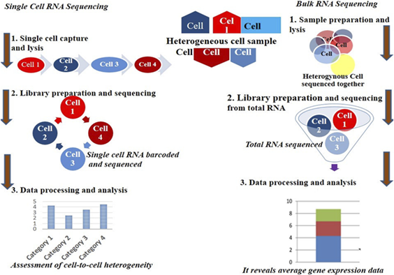

**Single Cells, Big Data: How One Cell Can Tell a Thousand Stories**

**INTRODUCTION**

Transcriptome sequencing is the sequencing of a cDNA library of all RNA transcripts in a cell. This technique can be used to precisely identify variable shear sites, uncover some rare and unknown transcripts, and analyze the structure and expression level of transcripts. Conventional RNA-Seq can only identify the population's average gene expression; it is unable to detect cell heterogeneity and can readily overlook the distinct expression of cell subsets (Jovic _et al_., 2022; Wang and Song. 2017). High-throughput single-cell transcriptome sequencing techniques have been progressively created as science and technology continue to advance. Unbiased, high-throughput transcriptome analysis of individual cells is now possible thanks to the new techniques that have improved transcriptome sequencing's throughput and detection limitations.The study of genes and their functional changes is extended to the single-cell level by single-cell sequencing. Although they are typically uncommon and particular, somatic mutations, such as single-nucleotide variations (SNVs) and copy-number variations (CNVs) (He _et al_., 2020), can now be identified as such. By integrating transcriptomic and genomic data, scientists can uncover mutation patterns, identify disease-related genes, and improve the accuracy and efficiency of single-cell sequencing technologies-ultimately enhancing our understanding of disease mechanisms (Wang _et al_., 2023).

Single-cell RNA sequencing (scRNA-seq) has transformed biology and medicine by enabling the study of gene expression in individual cells. This technique reveals cellular heterogeneity and communication networks and has been especially useful in identifying rare cancer cells, contributing to cancer research and personalized medicine. With the integration of spatial transcriptomics, genomics, epigenomics, and proteomics, scRNA-seq has become a versatile tool in both basic and clinical research. It has significantly advanced fields like immunology and oncology, which rely on understanding cellular interactions to develop effective treatments and improve patient care (Cheng _et al_., 2023). By analyzing patients' cells at a granular level, SCS helps doctors understand disease mechanisms more accurately and tailor treatments based on genetic, environmental, and lifestyle factors-leading to better outcomes and fewer side effects (Wang _et al_., 2025).

*Figure 1. An overview of Single-Cell RNA sequencing workflow (Wang et al., 2023)*

**From Averaged Data to Cellular Precision: The Single-Cell Revolution**

A single mammalian cell has roughly 10 pg of total RNA, of which only 1-5% is transcriptomic RNA. This is significantly less than the minimum need for building a single-cell transcriptome library (Liu _et al_., 2014). Transcriptomes need more starting RNA overall to track the activity of gene expression in cells. Furthermore, amplification bias and nucleic acid information loss are introduced by conventional transcriptome sequencing methods during the reverse transcription of mRNA into cDNA. When compared to conventional RNA-Seq, scRNA-Seq offers significant benefits in terms of identifying the molecular expression of specific cell subsets, screening for early illnesses, assessing clinical conditions, and elucidating the mechanism of medication action. The basis for the further development of scRNA-Seq was established when Tang _et al_. (2009) employed scRNA-Seq for the first time to examine the cDNA expression profile of a single blastomere of four-cell stage embryo mice and find aberrant expression genes in oocytes and blastocysts. Single-cell isolation, reverse transcription, cDNA synthesis, single-cell library, high-throughput sequencing, and data processing comprise the scRNA-Seq methodology (de Klerk and 't Hoen. 2015).

Figure 2: Single-Cell RNA seq and Bulk RNA seq (Desta and Birhanu. 2025)

**Biomedical Breakthroughs Through Single-Cell Transcriptomics**

Single-cell RNA sequencing (scRNA-seq) has emerged as a transformative technology in biomedical research, offering unmatched precision in analyzing cellular complexity across human, animal, and plant systems. By examining individual cells, researchers can uncover rare cell types, unique gene expression profiles, and intricate cellular interactions. These capabilities have revolutionized our understanding of biological systems, enabling discoveries in personalized medicine, developmental biology, and agricultural science. The ability to identify elusive cell subpopulations and decode molecular mechanisms behind disease progression has opened new avenues for targeted research and therapeutic innovation (Shojaee _et al_., 2021).

Although scRNA-seq was initially developed for animal and human studies, its application in plant biology is gaining momentum. Despite challenges such as limited knowledge of plant cell diversity and technical constraints, progress has been made-particularly with Arabidopsis thaliana, a widely used model organism. Arabidopsis offers advantages like a manageable cell count, well-defined gene markers, and effective cell isolation techniques. For instance, enzymatic digestion of the cell wall has proven useful for isolating plant cells and studying their gene expression. These advances are driving new insights into plant development, stress responses, and crop improvement (Bawa _et al_., 2022; Sun _et al_., 2024).

Single-cell transcriptomics enables a granular understanding of how individual cells interact with their environment and neighboring cells. This approach is especially valuable in clinical diagnostics, where studying rare or atypical cells can reveal critical information about disease progression, antimicrobial resistance, and tumor behavior. Outlier cells often play pivotal roles in pathology, making their analysis essential for developing targeted therapies. With the advent of advanced scRNA-seq technologies, researchers can now investigate cellular behavior with unprecedented accuracy, linking molecular insights to clinical applications and paving the way for personalized medicine (Algabri et al., 2022; Mohammadi et al., 2019). scRNA-seq allows for comprehensive profiling of both healthy and cancerous cells across different stages of tumor development. This enables precise comparisons and assessments of therapeutic efficacy. Initially, scRNA-seq focused on distinct tissue regions and cell types, generating rich datasets for deeper exploration (Lei et al., 2021). Additionally, scRNA-seq data can be used to infer gene regulatory networks (GRNs) by clustering co-expressed genes into regulatory modules. This enhances our understanding of gene interactions and regulatory mechanisms, further advancing tumor biology research (Dautle et al., 2023).

**Transforming Cancer Research with Single-Cell RNA Sequencing**

Single-cell RNA sequencing (scRNA-seq) has revolutionized cancer research by offering high-resolution insights into tumor heterogeneity, microenvironment dynamics, and treatment resistance. Unlike bulk sequencing, which averages gene expression across many cells, scRNA-seq analyzes individual cancer cells, uncovering genetic and phenotypic diversity that traditional methods often miss. Beyond profiling cancer cells, scRNA-seq reveals complex interactions between malignant cells and their surrounding microenvironment, including immune and stromal components. This detailed view helps identify specific cell types, molecular markers, and dynamic processes such as proliferation and metastasis. Its ability to detect rare, treatment-resistant cells makes scRNA-seq a powerful tool for developing targeted therapies and improving diagnostic accuracy (Bridges and Miller-Jensen, 2022). For example, scRNA-seq has been used to study T cell receptors in colorectal tumors, uncovering tissue organization, cancer variability, and gene expression patterns linked to drug response. It has also revealed transformations among T cell subclasses and identified genomic alterations such as copy number variations and DNA methylation changes during tumor progression (Castellanos-Rueda et al., 2021; Bian et al., 2018). This technology excels at tracking gene expression changes throughout cancer development. By comparing transcriptomes from healthy tissues and adenomas at various stages, researchers have identified clonal structures, genomic instability, and metabolic shifts that contribute to tumorigenesis. For instance, Chen et al. demonstrated that malignant cells in familial adenomatous polyposis retain epithelial traits while exhibiting rapid migration, highlighting the complexity of cancer evolution (Chen Y.-C. et al., 2019). In bladder cancer, scRNA-seq has been used to study the tumor microenvironment, including immune cells, blood vessels, and fibroblasts (Lee et al., 2020).

Single-cell analysis is instrumental in identifying molecular control points and therapeutic targets within tumors. It enables the detection of genetic and epigenetic changes that drive malignancy and resistance. Genome-wide mutation tracking helps pinpoint vulnerabilities in cancer cells, guiding the development of personalized treatments (Shalek and Benson, 2017; Mustachio and Roszik, 2022). Additionally, scRNA-seq uncovers regulatory networks and signaling pathways that govern cancer cell behavior.

**Enhancing Immune Landscapes with Single-Cell RNA Sequencing**

Single-cell RNA sequencing (scRNA-seq) has transformed immunology by enabling high-resolution profiling of immune cell populations. This technology allows researchers to identify novel immune cell types, characterize their functions, and map their interactions within complex immune networks. By dissecting the roles of specific immune subsets, scRNA-seq enhances our understanding of immune responses in contexts such as infections, autoimmune disorders, and cancer. These insights are instrumental in developing targeted therapies, including precision immunotherapies and treatments for chronic inflammatory conditions (Kuksin et al., 2021). One notable application of scRNA-seq is the study of natural killer (NK) cells in both humans and mice. Researchers have identified key distinctions between NK cells in the blood and spleen, as well as two major subclasses-NK1 and NK2-across different tissues and species. These findings deepen our knowledge of NK cell biology and improve the translational relevance of animal models (Crinier et al., 2018). Beyond infections, scRNA-seq is invaluable for studying immune variability driven by aging and disease. By profiling individual immune cells, researchers can precisely characterize genetic and transcriptional changes. For instance, scRNA-seq analysis of CD4+ T cells from young and aged mice revealed that aging increases transcriptomic variability, leading to greater heterogeneity in gene expression. This provides critical insights into how aging reshapes the immune system function at the molecular level (Martinez-Jimenez et al., 2017; Papalexi and Satija, 2018)**.**

**Unraveling Complexity in the Gastrointestinal and Urinary Systems with scRNA-seq**

Single-cell RNA sequencing (scRNA-seq) has become an essential tool for dissecting the cellular architecture and functional dynamics of the gastrointestinal (GI) and urinary tract systems. In the GI tract, scRNA-seq reveals the diverse roles of epithelial, immune, and stromal cells in digestion, nutrient absorption, and immune defense. It also provides molecular insights into diseases such as inflammatory bowel disease (IBD) and colorectal cancer. Similarly, in the urinary system, scRNA-seq maps the cellular composition of the kidney, bladder, and ureter, shedding light on processes like filtration, reabsorption, and urine formation. This technology also uncovers cellular responses in conditions such as chronic kidney disease (CKD) and urinary tract infections (UTIs) (Haque et al., 2017; Li et al., 2021).

By capturing cellular heterogeneity and dynamic states, scRNA-seq enhances our understanding of both normal physiology and disease mechanisms, driving progress in precision medicine. For example, Haber et al. used scRNA-seq to identify new subclasses of gut epithelial cells, offering insights into their roles in maintaining intestinal balance and responding to pathogens (Haber et al., 2017). In another study, Gao et al. applied high-resolution scRNA-seq to explore gene regulation in digestive organs during human embryonic development and in adult intestines. Their findings expanded knowledge of tissue-specific gene expression and developmental pathways, providing valuable perspectives on organ function and maturation (Gao et al., 2018).

**Decoding the Nervous System with Single-Cell Transcriptomics**

Single-cell RNA sequencing (scRNA-seq) has revolutionized neuroscience by uncovering the cellular and molecular diversity of the nervous system. This technology enables precise identification of neuronal and glial cell types, offering insights into their roles in brain development, function, and plasticity. In neurodegenerative diseases like Alzheimer's, Parkinson's, and multiple sclerosis, scRNA-seq has revealed disease-associated cell states, neuroinflammatory pathways, and potential biomarkers. It has also provided valuable perspectives on psychiatric disorders such as schizophrenia and autism by illuminating mechanisms behind neural circuit dysfunction. These discoveries support the development of personalized therapies and novel treatment strategies (Ofengeim et al., 2017; Cuevas-Diaz Duran et al., 2022).

The inherent variability among neurons, often driven by copy number variations, complicates efforts to map brain circuitry. scRNA-seq addresses this challenge by capturing different stages of neuronal differentiation and classifying neuron subtypes based on molecular signatures. Advanced techniques like single-cell methylation sequencing have further refined our understanding by identifying methylation patterns that distinguish neuronal subclasses in both mouse and human frontal cortices (Xing et al., 2023).

Innovative approaches such as single-cell nuclear sequencing have also been used to trace cell lineages in the adult brain, revealing principal cell classes and their functional roles. These methods deepen our understanding of brain organization and cellular diversity. Additionally, scRNA-seq has played a key role in cerebellar development research, identifying distinct cerebellar cell subsets and clarifying their contributions to brain maturation. These findings lay the foundation for future studies in neurobiology and neurological disorders (Cardona-Alberich et al., 2021; Rosenberg et al., 2018).

**Advancing Reproductive and Embryonic Medicine with Single-Cell Sequencing**

Single-cell RNA sequencing (scRNA-seq) plays a pivotal role in analyzing small cell populations, offering transformative applications in reproductive health and prenatal diagnostics. By profiling egg cells and early embryonic stages, scRNA-seq aids in selecting healthy embryos, potentially reducing genetic disorders and preventing hereditary conditions in newborns (Hou et al., 2013; Li et al., 2017). This technology has shifted early developmental research from hypothesis-driven to discovery-driven approaches, enabling deeper exploration of mammalian embryogenesis (Yan et al., 2013).

In model organisms such as zebrafish and African cockroaches, scRNA-seq has provided valuable insights into cell growth and developmental biology (Briggs et al., 2018). Additionally, multi-sequence single-cell technologies have been used to map human embryos before implantation, revealing complex epigenetic processes that shape early development (Alanis-Lobato et al., 2024). For example, Vento-Tormo et al. applied scRNA-seq to placental cells prior to gestation, generating detailed cellular maps that identified subpopulations and regulatory interactions essential for placental formation and maternal immune modulation (Vento-Tormo et al., 2018).

In male reproductive biology, scRNA-seq has been instrumental in tracing gene expression during spermatogenesis. It has uncovered alternative splicing patterns and key regulators of germ cell development (Chen et al., 2018). The technology has also been applied to both healthy and diseased human testicular tissues, revealing hierarchical structures among spermatogonial, spermatocyte, and sperm cell subclasses, along with specific germ cell markers. Notably, scRNA-seq has identified altered expression profiles in testicular somatic cells from non-obstructive azoospermia (NOA) patients, offering new insights into the disease's molecular basis (Wang et al., 2018).

**Overcoming Technical Challenges in Single-Cell RNA Sequencing**

While single-cell RNA sequencing (scRNA-seq) offers unparalleled insights into cellular transcriptomics, several technical hurdles remain. One major limitation is its low capture efficiency current methods typically recover only about 10% of a cell's transcriptome. This restricts sensitivity and makes it difficult to detect low-abundance transcripts (Saliba et al., 2014; Deng et al., 2014). Additionally, the minimal input material required for scRNA-seq introduces significant technical noise, complicating data interpretation and potentially masking true biological signals (Kolodziejczyk et al., 2015; Marinov et al., 2014). Cell isolation methods also present challenges. Techniques like micro-manipulation and laser capture require specialized equipment and are labor-intensive. More commonly, cells are dissociated from tissues into suspensions for sequencing, but enzymatic treatments used in this process can compromise cell viability and alter transcriptional profiles (Machado et al., 2021). To address these issues, some researchers have developed protocols for sequencing RNA directly from isolated nuclei, avoiding harsh treatments and preserving transcriptional integrity (Grindberg et al., 2013).

Despite technological advancements, limited capture efficiency and high noise levels continue to impact the accuracy and reproducibility of scRNA-seq data. Ongoing efforts focus on refining experimental workflows and improving data reliability (Ding et al., 2015).

Emerging in situ sequencing techniques offer a promising alternative by enabling RNA capture and amplification within intact tissue environments. These methods allow for direct sequencing of RNA inside cells, using rolling circle amplification of cDNA amplicons. While they preserve spatial context, current in situ approaches are limited in throughput, typically quantifying only a few hundred genes per cell (Lee et al., 2015).

**CONCLUSION**

The transition from bulk transcriptomic analysis to single-cell resolution has marked a paradigm shift in life sciences. Traditional methods, while useful for population-level insights, obscure nuanced variability among individual cells. scRNA-seq addresses this limitation by capturing transcriptomic signatures at the single-cell level, revealing rare subtypes, transcriptional noise, and dynamic cellular states. In oncology, scRNA-seq has enabled the dissection of tumor heterogeneity, identification of treatment-resistant subpopulations, and mapping of gene regulatory networks. These insights are critical for developing targeted therapies and understanding tumor evolution. Similarly, in immunology, scRNA-seq has uncovered novel immune cell subsets and clarified immune responses in aging, infection, and autoimmunity.

Despite its strengths, scRNA-seq faces challenges including limited transcript capture, technical noise, and complex cell isolation procedures. Emerging in situ sequencing methods offer promising alternatives by preserving spatial context, though they currently lack high-throughput capabilities. Overall, scRNA-seq continues to evolve as a cornerstone of modern biology, bridging molecular insights with clinical applications and paving the way for personalized medicine.

**REFERENCES**

Jovic, D., Liang, X., Zeng, H., Lin, L., Xu, F., & Luo, Y. (2022). Single-cell RNA sequencing technologies and applications: A brief overview. _Clinical and translational medicine_, _12_(3), e694. <https://doi.org/10.1002/ctm2.694>

Wang, J., & Song, Y. (2017). Single cell sequencing: a distinct new field. _Clinical and translational medicine_, _6_(1), 10. <https://doi.org/10.1186/s40169-017-0139-4>

He, X., Memczak, S., Qu, J., Belmonte, J. C. I., & Liu, G. H. (2020). Single-cell omics in ageing: a young and growing field. _Nature metabolism_, _2_(4), 293-302. <https://doi.org/10.1038/s42255-020-0196-7>

Wang, S., Sun, S. T., Zhang, X. Y., Ding, H. R., Yuan, Y., He, J. J., Wang, M. S., Yang, B., & Li, Y. B. (2023). The Evolution of Single-Cell RNA Sequencing Technology and Application: Progress and Perspectives. _International journal of molecular sciences_, _24_(3), 2943. <https://doi.org/10.3390/ijms24032943>

Cheng C., Chen W., Jin H., Chen X. (2023). A Review of Single-Cell RNA-Seq Annotation, Integration, and Cell-Cell Communication. _Cells_, 12(15), 1970. <https://doi.org/10.3390/cells12151970>

Wang X., Li N., Wang W., et al. (2025). Single-cell sequencing: accurate disease detection. _Clin Transl Oncol_. <https://doi.org/10.1007/s12094-025-04007-8>

Liu, N., Liu, L., & Pan, X. (2014). Single-cell analysis of the transcriptome and its application in the characterization of stem cells and early embryos. _Cellular and molecular life sciences : CMLS_, _71_(14), 2707-2715. <https://doi.org/10.1007/s00018-014-1601-8>

de Klerk, E., & 't Hoen, P. A. (2015). Alternative mRNA transcription, processing, and translation: insights from RNA sequencing. _Trends in genetics : TIG_, _31_(3), 128-139. <https://doi.org/10.1016/j.tig.2015.01.001>

Tang, F., Barbacioru, C., Wang, Y., Nordman, E., Lee, C., Xu, N., Wang, X., Bodeau, J., Tuch, B. B., Siddiqui, A., Lao, K., & Surani, M. A. (2009). mRNA-Seq whole-transcriptome analysis of a single cell. _Nature methods_, _6_(5), 377-382. <https://doi.org/10.1038/nmeth.1315>

Shojaee A. Saavedra M. Huang S.-S. C. (2021). Potentials of single-cell genomics in deciphering cellular phenotypes. _Curr. Opin. plant Biol._63, 102059. 10.1016/j.pbi.2021.102059.

9\. Bawa G. Liu Z. Yu X. Qin A. Sun X. (2022). Single-cell RNA sequencing for plant research: insights and possible benefits. _Int. J. Mol. Sci._23, 4497. 10.3390/ijms23094497.

10\. Sun Y. Sun J. Lin C. Zhang J. Yan H. Guan Z. et al (2024). Single-cell transcriptomics applied in plants. _Cells_13, 1561. 10.3390/cells13181561.

Algabri Y. A. Li L. Liu Z. P. (2022). scGENA: a single-cell gene coexpression network analysis framework for clustering cell types and revealing biological mechanisms. _Bioeng. (Basel)_9, 353. 10.3390/bioengineering9080353

Mohammadi, P., Castel, S. E., Cummings, B. B., Einson, J., Sousa, C., Hoffman _et al.,_(2019). Genetic regulatory variation in populations informs transcriptome analysis in rare disease. _Science (New York, N.Y.)_, _366_(6463), 351-356. <https://doi.org/10.1126/science.aay0256>.

Hinshaw, D. C., & Shevde, L. A. (2019). The Tumor Microenvironment Innately Modulates Cancer Progression. _Cancer research_, _79_(18), 4557-4566. <https://doi.org/10.1158/0008-5472.CAN-18-3962>

Lei, Y., Tang, R., Xu, J., Wang, W., Zhang, B., Liu, J., Yu, X., & Shi, S. (2021). Applications of single-cell sequencing in cancer research: progress and perspectives. _Journal of hematology & oncology_, _14_(1), 91. <https://doi.org/10.1186/s13045-021-01105-2>

Bridges, K., & Miller-Jensen, K. (2022). Mapping and Validation of scRNA-Seq-Derived Cell-Cell Communication Networks in the Tumor Microenvironment. _Frontiers in immunology_, _13_, 885267. <https://doi.org/10.3389/fimmu.2022.885267>

Castellanos-Rueda R.Di Roberto R. B.Schlatter F. S.Reddy S. T.(2021). Leveraging single-cell sequencing for chimeric antigen receptor T cell therapies. _Trends Biotechnol._39, 1308-1320. 10.1016/j.tibtech.2021.03.005

Bian S.Hou Y.Zhou X.Li X.Yong J.Wang Y.et al (2018). Single-cell multiomics sequencing and analyses of human colorectal cancer. _Science_362, 1060-1063. 10.1126/science.aao3791

Chen Y.-C.Sahoo S.Brien R.Jung S.Humphries B.Lee W.et al (2019b). Single-cell RNA-sequencing of migratory breast cancer cells: Discovering genes associated with cancer metastasis. _Analyst_144, 7296-7309. 10.1039/c9an01358j

Lee H. W.Chung W.Lee H.-O.Jeong D. E.Jo A.Lim J. E.et al (2020). Single-cell RNA sequencing reveals the tumor microenvironment and facilitates strategic choices to circumvent treatment failure in a chemorefractory bladder cancer patient. _Genome Med._12, 47-21. 10.1186/s13073-020-00741-6

Shalek A. K.Benson M.(2017). Single-cell analyses to tailor treatments. _Sci. Transl. Med._9, eaan4730. 10.1126/scitranslmed.aan4730

Mustachio L. M.Roszik J.(2022). Single-cell sequencing: Current applications in precision onco-genomics and cancer therapeutics. _Cancers_14, 657. 10.3390/cancers14030657

Kuksin M.Morel D.Aglave M.Danlos F.-X.Marabelle A.Zinovyev A.et al (2021). Applications of single-cell and bulk RNA sequencing in onco-immunology. _Eur. J. cancer_149, 193-210. 10.1016/j.ejca.2021.03.005

Crinier A.Milpied P.Escaliere B.Piperoglou C.Galluso J.Balsamo A.et al (2018). High-dimensional single-cell analysis identifies organ-specific signatures and conserved NK cell subsets in humans and mice. _Immunity_49, 971-986. e5. 10.1016/j.immuni.2018.09.009

Xin G.Zander R.Schauder D. M.Chen Y.Weinstein J. S.Drobyski W. R.et al (2018). Single-cell RNA sequencing unveils an IL-10-producing helper subset that sustains humoral immunity during persistent infection. _Nat. Commun._9, 5037. 10.1038/s41467-018-07492-4